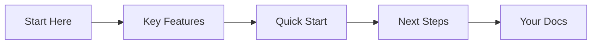

## Overview

Test test provides a centralized space for your project documentation. You create, organize, and manage all docs in one intuitive platform. Customize layouts, embed components, and collaborate seamlessly with your team.

<Callout kind="info">
Test test supports MDX for rich, interactive documentation with components like Cards, Steps, and Tabs.
</Callout>

## Key Features

Test test offers powerful tools for documentation management.

<Columns cols={3}>
  <Card title="Rich Components" icon="components" href="#rich-components">
    Use interactive elements like `<Steps>`, `<Tabs>`, and `<CodeGroup>` to engage readers.
  </Card>
  <Card title="Version Control" icon="git-branch" href="#version-control">
    Track changes with built-in Git integration and changelog support.
  </Card>
  <Card title="Team Collaboration" icon="users" href="#collaboration">
    Share docs securely and collaborate in real-time.
  </Card>
</Columns>

These features help you build professional docs quickly.

## Benefits for Teams and Projects

You streamline workflows by centralizing all documentation. Teams reduce onboarding time with interactive guides. Projects stay organized as you scale. Maintain consistency across repositories with custom themes and reusable components.

<Callout kind="tip">
Start small: Create your first doc page and add a `<Steps>` component for setup instructions.
</Callout>

## Quick Start

Get up and running in minutes.

<Steps>
  <Step title="Sign Up" icon="user-plus">
    Visit `https://app.testtest.com` and create your account.
  </Step>
  <Step title="Create Workspace" icon="folder-plus">
    Set up a new documentation space for your project.
  </Step>
  <Step title="Add First Page" icon="file-plus">
    Use the MDX editor to build your introduction.

````mdx
<CodeGroup tabs="npm,yarn">
```bash
npm install testtest-docs
```
```bash
yarn add testtest-docs
```
</CodeGroup>
````

  </Step>
  <Step title="Publish" icon="globe">
    Deploy your site with one click.
  </Step>
</Steps>

## Quick Navigation

Explore core areas next.

<Columns cols={2}>
  <Card title="Quickstart Guide" icon="zap" href="/quickstart">
    Set up your first documentation site.
  </Card>
  <Card title="Authentication" icon="lock" href="/authentication">
    Secure your docs with API keys.
  </Card>
  <Card title="Customization" icon="palette" href="/configuration">
    Tailor themes and layouts.
  </Card>
  <Card title="Changelog" icon="git-commit" href="/changelog">
    Track updates and releases.
  </Card>
</Columns>



You now have the foundation. Dive into the quickstart for hands-on setup.